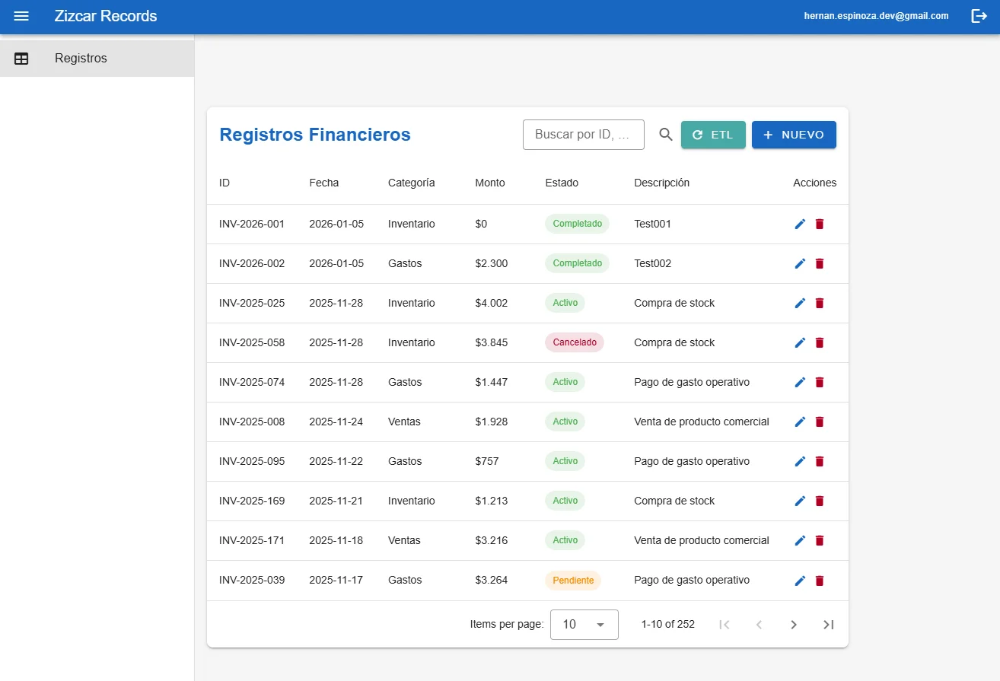
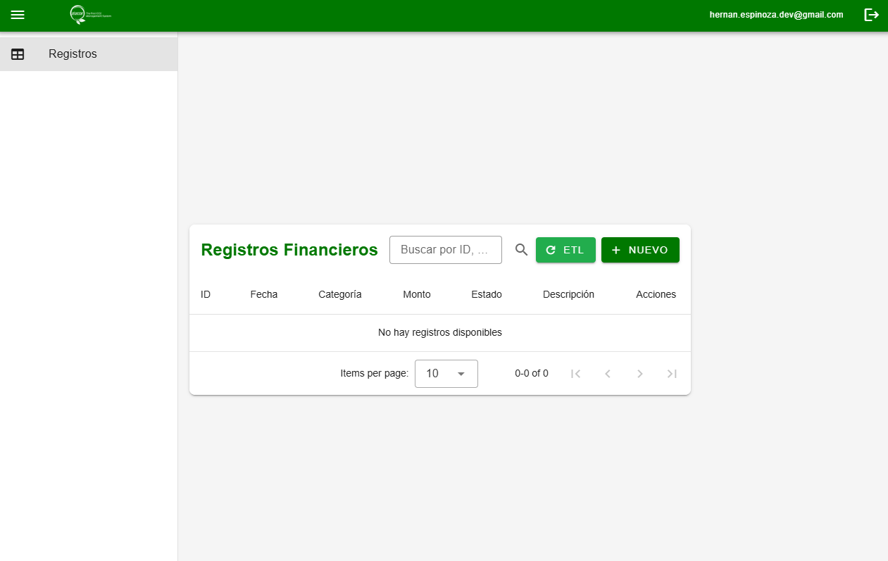
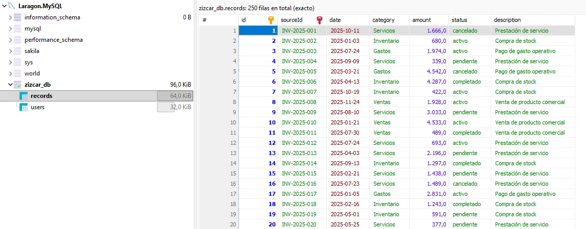
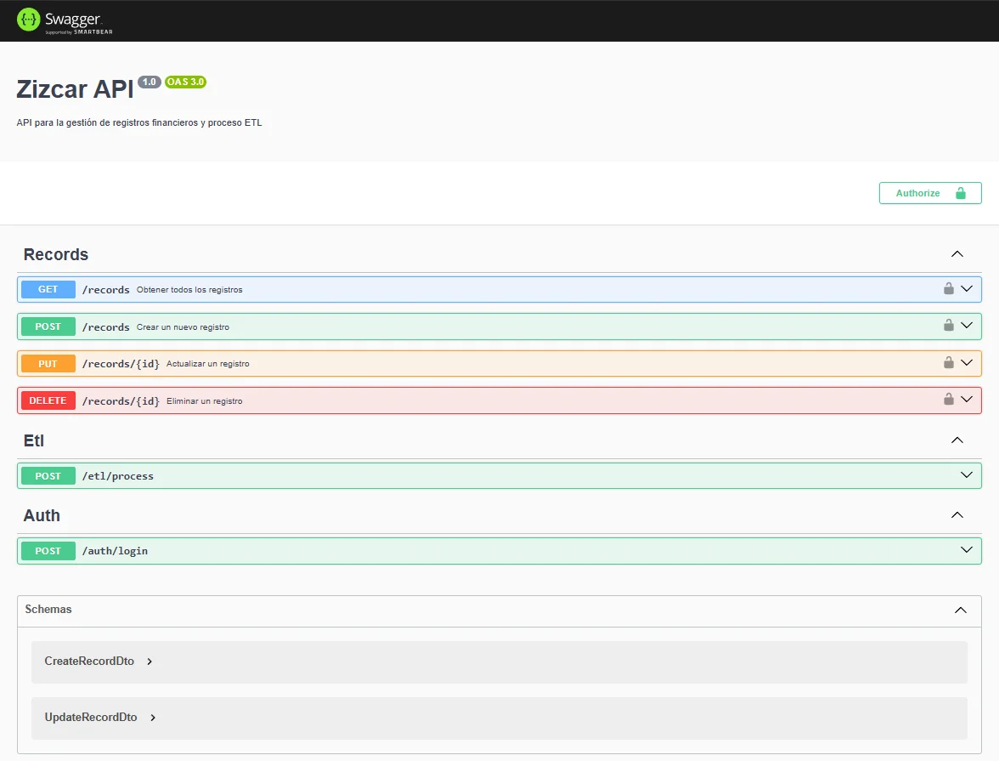

# Prueba Técnica -

## 📋 Descripción del Desafío

Este repositorio contiene un proyecto base para implementar un **pipeline completo de ingesta de datos** desde un PDF hacia una base de datos MySQL, con una API REST en NestJS y una interfaz web en Vue 3 + Vuetify 3, terminando de mostrar los datos en un PowerBI con una conexión directa desde la base de datos.

### Objetivo Principal

El candidato debe implementar un sistema que:
1. **Extraiga** datos estructurados desde un archivo PDF (`/data/data.pdf`)
2. **Normalice** los datos extraídos hacia un formato estándar
3. **Cargue** los datos normalizados en MySQL de forma idempotente
4. **Exponga** una API REST con autenticación JWT
5. **Muestre** los datos en una interfaz web con Vue 3 + Vuetify 3
6. **Cree** un dashboard en PowerBI

## 🏗️ Estructura del Proyecto

```
practica_test/
├── backend/          # API NestJS - Debes crear el proyecto desde cero
├── frontend/         # App Vue 3 + Vuetify 3 - Debes crear el proyecto desde cero
├── data/             # Dataset PDF y documentación
```

## 🚀 Inicio Rápido

### Prerrequisitos
- **Laragon** instalado y funcionando (incluye Node.js y MySQL)
- Node.js (viene con Laragon)
- MySQL (viene con Laragon)
- pnpm o npm

### Pasos Generales

1. **Revisa cada carpeta**: Cada carpeta (`/backend`, `/frontend`, `/data`) tiene su propio README con instrucciones específicas.

2. **Empieza por el backend**: Sigue las instrucciones en `/backend/README.md`

3. **Luego el frontend**: Sigue las instrucciones en `/frontend/README.md`

4. **Usa los datos de ejemplo**: Revisa `/data/README.md` para entender la estructura esperada

5. **Crea el dashboard PowerBI**: Crear visualizaciones

## 📊 PowerBI Dashboard

Como parte final del proyecto, debes crear un dashboard en PowerBI Desktop que:

1. **Conecte directamente a MySQL** usando el conector nativo de MySQL
2. **Importe los datos** de la tabla `records`
3. **Crea visualizaciones** como:
   - Gráfico de montos por categoría
   - Tabla de registros con filtros
   - Gráfico de tendencias por fecha
   - Métricas agregadas (total, promedio, etc.)


## 📚 Documentación

- **[Backend README](./backend/README.md)** - Instrucciones para crear la API NestJS
- **[Frontend README](./frontend/README.md)** - Instrucciones para crear la app Vue 3 + Vuetify 3
- **[Data README](./data/README.md)** - Información sobre el PDF y estructura de datos

## ✅ Qué Entregar

1. **Repositorio Git** con git commit de todo el código realizado hasta las 17hrs del 06-01-2026
2. **Dashboard PowerBI** con visualizaciones de los datos

## 🛠️ Stack Tecnológico

- **Backend**: NestJS, TypeScript, MySQL, JWT
- **Frontend**: Vue 3, Vuetify 3, Pinia, Axios
- **Base de Datos**: MySQL
- **BI**: PowerBI Desktop

## 📞 Notas Importantes

- **NO** hay código base implementado. Debes crear todo desde cero siguiendo los READMEs.
- Cada carpeta tiene instrucciones específicas sobre qué implementar.
- Usa Laragon para gestionar MySQL y Node.js.

---

**¡Buena suerte!🚀**

---

# 🚀 Prueba Técnica Zizcar - Hernán Espinoza.

> **Sistema centralizado para la gestión de registros financieros e importación automática de datos mediante procesos ETL.**
> Este proyecto implementa una arquitectura **Fullstack** moderna utilizando **NestJS** para el backend y **Vue 3** para el frontend, garantizando escalabilidad, tipado estricto y una experiencia de usuario fluida.


---

## 🛠️ Tecnologías (Stack)

### Backend (API)
- **Framework:** [NestJS](https://nestjs.com/) (Arquitectura modular).
- **Base de Datos:** MySQL (vía TypeORM).
- **Procesamiento:** `pdf-parse` para extracción de datos no estructurados.
- **Seguridad:** JWT (JSON Web Tokens) + Bcrypt.
- **Documentación:** Swagger (OpenAPI).

### Frontend (UI)
- **Framework:** [Vue 3](https://vuejs.org/) (Composition API).
- **UI Store:** [Pinia](https://pinia.vuejs.org/) (Gestión de estado global).
- **Componentes:** [Vuetify 3](https://vuetifyjs.com/) (Material Design).
- **Tipado:** TypeScript estricto.

### Herramientas
- **Entorno Local:** Laragon.
- **Cliente HTTP:** Axios.

---

## 📂 Estructura del Proyecto

```plaintext
prueba-tecnica-zizcar/
├── backend/                # API NestJS
│   ├── src/
│   │   ├── etl/            # Servicio de extracción de datos PDF
│   │   ├── records/        # Módulo de Registros Financieros (CRUD)
│   │   └── auth/           # Módulo de Autenticación y Guardias
│   └── generated/          # Archivos intermedios (CSV/JSON) del ETL
├── frontend/               # App Vue 3
│   ├── src/
│   │   ├── composables/    # Lógica de negocio reutilizable (Hooks)
│   │   ├── stores/         # Estados globales (Pinia)
│   │   └── views/          # Páginas principales (Login, Records)
└── data/                   # Archivos fuente (PDFs de ejemplo)
```

---

## ⚙️ Instalación y Configuración

Sigue estos pasos para levantar el entorno de desarrollo localmente.

### 1. Clonar el repositorio

```bash
git clone https://github.com/HernanEspinozaDev/prueba-tecnica-zizcar.git
cd prueba-tecnica-zizcar
```

### 2. Configuración de Base de Datos (MySQL)

Este proyecto asume una configuración local estándar (en este caso se uso con **Laragon**).

> **IMPORTANTE:** Debes crear la base de datos manualmente antes de iniciar el backend.

1.  Abre tu cliente SQL favorito (ej: **HeidiSQL**, **DBeaver**).
2.  Crea una nueva base de datos llamada `zizcar_db`.
3.  Asegúrate de tener un usuario con los siguientes accesos (o modifica el `.env` del backend):
    *   **Usuario:** `root`
    *   **Contraseña:** `Admin12345`

```sql
-- Script SQL de creación rápida
CREATE DATABASE IF NOT EXISTS zizcar_db;
```

### 3. Configuración del Backend

```bash
cd backend

# Instalar dependencias
npm install

# Iniciar servidor en modo desarrollo
npm run start:dev
```

*El backend se iniciará en `http://localhost:3000` y creará las tablas automáticamente (TypeORM Sync).*

### 4. Configuración del Frontend

```bash
cd frontend

# Instalar dependencias
npm install

# Iniciar servidor de desarrollo
npm run dev
```

*El frontend estará disponible en `http://localhost:5173`.*

---

## 📖 Uso de la Aplicación

### Credenciales de Acceso
El sistema cuenta con un proceso de **Self-Seeding**. Al iniciar el backend por primera vez, se crea un usuario administrador automáticamente:

| Rol | Email | Contraseña |
| :--- | :--- | :--- |
| **Admin** | `hernan.espinoza.dev@gmail.com` | `Admin123` |

### Flujo de Trabajo
1.  **Login:** Ingresa con las credenciales de administrador.
2.  **Dashboard de Registros:** Verás una tabla vacía inicialmente.
3.  **Ejecutar ETL:** Haz clic en el botón **"ETL"** (o "Run ETL").
    *   El sistema leerá `data/data.pdf`.
    *   Extraerá y normalizará las facturas.
    *   Poblará la base de datos MySQL.
4.  **Gestión:** Puedes Editar, Crear manualmenten o Eliminar registros.

---

## 📖 Documentación de la API (Swagger)

Con el backend corriendo, accede a la documentación interactiva para probar los endpoints directamente:

🔗 **URL:** [http://localhost:3000/api/docs](http://localhost:3000/api/docs)

---

## 🧪 Funcionalidades Principales

### 🔄 Procesamiento ETL Inteligente
- **Lectura Dinámica:** Busca archivos PDF en rutas relativas automáticamente.
- **Normalización:** Convierte fechas y montos a formatos estándar ISO y numéricos.
- **Idempotencia:** Evita registros duplicados utilizando `upsert` basado en el ID de la factura (`INV-XXXX`).

### 🔒 Seguridad Robusta
- **Guards:** Protección de rutas mediante `JwtAuthGuard`.
- **Interceptors:** Manejo global de errores y transformación de respuestas.

### 🎨 UI Reactiva y Moderna
- **Feedback Inmediato:** Sistema de notificaciones global (Snackbars) para éxito/error.
- **Diseño Responsivo:** Adaptable a móviles y escritorio gracias a Vuetify.

---

## 📷 Visualización

### Dashboard Principal


### Estado Inicial (Sin Datos)


### Estructura de Base de Datos


### Documentación de API


---

Hecho por **[HernanEspinozaDev](https://github.com/HernanEspinozaDev)**
